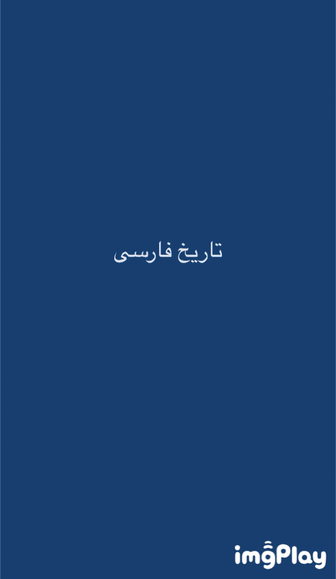

# PersianDatePicker
An extension to have Persian Date PickerView
> <div dir="rtl">یک اکستنشن ساده برای انتخاب تاریخ شمسی و درصورت نیاز تبدیل آن به تاریخ میلادی.</div>
-----



## How To Use
-----

- Copy `PersianDatePickerExtentions\PersianDatePicker+ViewController.swift` file to your project.
- Inside `PersianDatePicker+ViewController.swift` file change the the viewController class name to your viewController class name where you what to have the pickerView.
- Inside `PersianDatePicker+ViewController.swift` file change the textField IBOutlet name to your textField IBOutlet name.
- Declare datePicker and call showDatePicker inside you viewControlleer class:
```swift 
class YOURViewController: UIViewController {

let datePicker = UIDatePicker() 
 
override func viewDidAppear(_ animated: Bool) {
        super.viewDidAppear(animated)
        
        showDatePicker()
    }
```


## Authors
- [Farid Daryabar](https://www.linkedin.com/in/fariddaryabar)

-----


